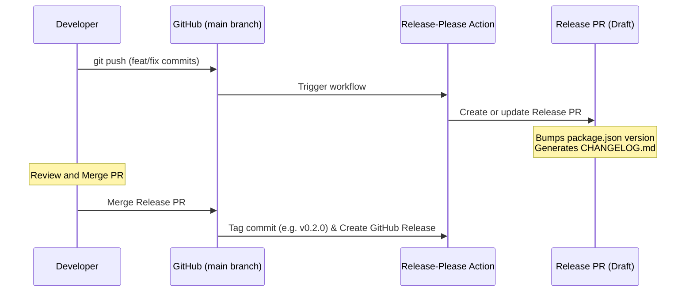

# llama-gateway — Release Management Guide

This project uses Google's [release-please](https://github.com/googleapis/release-please) to automate version bumps, changelog generation, and GitHub releases. 

Releases are triggered automatically when you push commits to the `main` branch that follow the **Conventional Commits** specification.

---

## 1. Commit Message Convention

`release-please` parses your git commit messages to decide how to bump the version (major, minor, or patch) and what to add to the `CHANGELOG.md`.

Format:
```text
<type>(<scope>): <description>

[optional body]

[optional footer(s)]
```

### Types & Release Bumps

| Commit Type | Description | Release Bump | Example |
| :--- | :--- | :--- | :--- |
| `fix` | A bug fix | **PATCH** (0.1.x) | `fix(middleware): resolve pair-eviction crash` |
| `feat` | A new feature | **MINOR** (0.x.0) | `feat(router): add conditional image routing` |
| appending `!` | A breaking change | **MAJOR** (x.0.0) | `feat(config)!: rename model_path to path` |
| `chore`, `docs`, `test`, `refactor`, `style` | Internal changes (no bump) | *None* | `docs(readme): update installation guide` |

### Breaking Changes (Major Bumps)
To trigger a **MAJOR** version bump:
1. Append a `!` after the type/scope (e.g. `feat(config)!: remove old flags`).
2. AND/OR include `BREAKING CHANGE: <explanation>` in the commit message footer.

---

## 2. Using VS Code Conventional Commits

We have pre-configured the **VS Code Conventional Commits** extension (`vivaxy.vscode-conventional-commits`) in your project settings to make this seamless.

### How to commit:
1. Stage your files in VS Code's Source Control panel.
2. Click the **Conventional Commits** icon (next to the commit input box) or open the Command Palette (`Ctrl+Shift+P` / `Cmd+Shift+P`) and select **Conventional Commits**.
3. Follow the interactive prompts:
   - **Type**: Choose `feat`, `fix`, `docs`, etc.
   - **Scope**: Choose a pre-defined scope (e.g., `config`, `middleware`, `generator`, `cli`, `proxy`, `docs`, `general`).
   - **Subject**: Enter a short description (in imperative mood, e.g., "add release-please workflow").
   - **Body**: Enter detailed context (optional).
   - **Footer**: If it's a breaking change, enter `BREAKING CHANGE: <what broke and how to migrate>` here (optional).
4. The extension will generate the message in your commit box. Click **Commit** to save.

---

## 3. The Release Lifecycle

Once you commit and push to GitHub, the following flow happens:



1. **Push to `main`**: Push your conventional commits to the `main` branch.
2. **Release PR Opened**: `release-please` runs on GitHub Actions. It scans your commits and opens a draft **Release PR** (e.g., `chore: release 0.2.0`). This PR contains the version bump in `package.json` and the updated `CHANGELOG.md`.
3. **Merging to Release**: As you push more commits, `release-please` automatically updates the same Release PR. When you are ready to release, simply **Merge the Release PR**.
4. **Tag & Release**: Merging the PR triggers the action to tag the commit with the new version (e.g., `v0.2.0`) and create a GitHub Release with the generated changelog notes.

---

## 4. Automatic npm Publishing (Optional Setup)

If you want to automatically publish the package to npm whenever a Release PR is merged, update `.github/workflows/release-please.yml` to include a publish step:

```yaml
      - uses: google-github-actions/release-please-action@v4
        id: release
        with:
          release-type: node

      # Trigger publishing only when a release is successfully created
      - name: Publish to npm
        if: ${{ steps.release.outputs.releases_created }}
        run: |
          npm config set //registry.npmjs.org/:_authToken=${{ secrets.NPM_TOKEN }}
          bun publish --access public
```

*Note: You will need to add your npm token to your GitHub repository secrets as `NPM_TOKEN` for this to work.*
